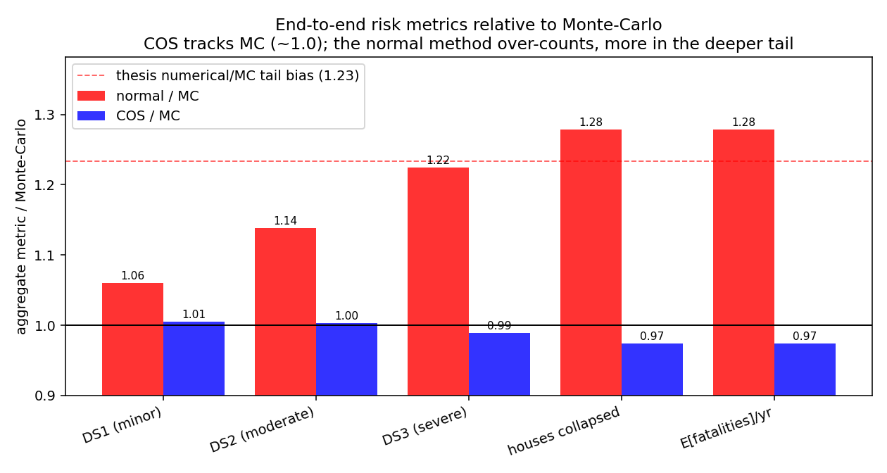

# saavg-cos — a deterministic COS method for the SaAvg distribution

A fast, deterministic replacement for Monte-Carlo in the intensity-measure stage
of the **Groningen** seismic hazard and risk chain. It reconstructs the *full,
non-normal* distribution of the average spectral acceleration (**SaAvg**) from its
leading cumulants by **Fourier–cosine (COS)** inversion — matching Monte-Carlo
accuracy at the speed of the normal moment-matching method, while storing three
numbers per scenario instead of a histogram.

> **Read the report:** [`report/report.pdf`](report/report.pdf) (compiled) ·
> [`report/report.md`](report/report.md) (renders with figures on GitHub) ·
> [`report/report.tex`](report/report.tex) (source).
> Rebuild with `tectonic report/report.tex` (or `pdflatex` twice).



*Carried end-to-end, COS reproduces the Monte-Carlo expected damage, collapse and
fatality counts to within 1–3 %; the normal method over-counts the
skew-sensitive tail by up to 28 %.*

## Why

Conditional on the reference ground motion, SaAvg is Gaussian, so each scenario is
a small **Gaussian mixture**. Its cumulants `(k1, k2, k3)` are obtained by shared
PCA + Gauss–Hermite quadrature, and the cumulant characteristic function
`φ(u) = exp(i k1 u − ½ k2 u² − i k3 u³/6)` is inverted by COS. The non-linear site
amplification makes SaAvg **negatively skewed**; the normal method ignores this
and over-estimates the upper-tail exceedances that dominate risk. COS captures the
skew and removes the bias — see the convergence test below.

## Key results (all reproduced by the scripts here)

| | result |
|---|---|
| **Accuracy** | COS exceedance probabilities ride the Monte-Carlo sampling-noise floor; the normal method plateaus at a fixed skew bias ~2 orders of magnitude larger (Fig. 3). |
| **Speed** | Full GMM-V7 logic tree — 144 branches × 95.2 M zone-scenarios — in **≈137 s** (≈2.3 min) on 18 cores; 784 MB cumulant lookup, no histograms. |
| **End-to-end** | COS reproduces MC expected fatalities/collapses to ~1–3 %; normal over-counts by up to 28 % (matches the independently reported 1.23× Groningen Meijdam over-count). |
| **Maps** | Per-zone hazard over the Groningen field (zone ids join the geological shapefile 160/160). |

## Install

```bash
python -m venv venv && source venv/bin/activate
pip install -r requirements.txt          # or: pip install -e .
```

Python ≥ 3.10. Core deps: numpy, scipy, pandas, xarray, zarr, matplotlib;
`geopandas` only for the maps.

## Quickstart

```python
import numpy as np, saavg_cos as s

gmm = s.load_ground_motion_model("central")          # any logic-tree branch
sc  = s.compute_scenarios(gmm, np.array([5.5, 6.5]),  # magnitudes
                               np.array([5.0, 20.0]),  # distances (km)
                               pca_rank=2, gh_order=7) # fast production setting
print(sc.k1.shape, sc.skewness.max())                # (160 zones, 4 cells)

# full SaAvg distribution for one cell, by COS inversion of the cumulants
from saavg_cos import cos_cache
x = np.linspace(sc.k1[0,0]-3, sc.k1[0,0]+3, 200)     # ln(SaAvg), cm/s^2
cdf = cos_cache.cumulant_cos_cdf(x, sc.k1[:1,0], sc.k2[:1,0], sc.k3[:1,0])[0]
```

## Reproduce everything

```bash
make test          # fast correctness tests (pytest)            ~2 s
make validate      # COS vs Monte-Carlo (cumulants + PoE)        ~min
make lookup        # full all-branches COS IM lookup zarr        ~2-3 min, 784 MB
make figures       # hazard map + risk metrics + MP scaling      ~3 min
make accuracy      # density + dispersion (MC-heavy)             ~min
make convergence   # convergence to MC, 1e8 samples (very heavy) ~10-20 min
```

Pin one BLAS thread per worker for the parallel run (`make lookup`/`benchmark`):
the `Makefile` sets `VECLIB_MAXIMUM_THREADS=1 OMP_NUM_THREADS=1`; override `PIN`
for your BLAS backend.

## Repository layout

```
saavg_cos/            the package
  model.py            load GMM-V7 (any branch) + fragility; branch enumeration
  gmm_V7.py           vendored GMM-V7 reference / amplification functions
  spectral_im.py      per-scenario cumulants (PCA + Gauss-Hermite), no histograms
  cos_cache.py        COS reconstruction of CDF / exceedance + skewness cache
  fragility.py        closed-form probability-of-damage expectation
  source.py           transparent Gutenberg-Richter source stand-in
  risk_hazard.py      hazard curves + annual risk
  chain.py            end-to-end driver
  mc.py               Monte-Carlo reference (validation only)
data/                 bundled GMM-V7/FCM-V7 params + zone geometry (see data/README.md)
scripts/              prepare_im_lookup, validate_against_mc, make_hazard_map,
                      compare_risk_metrics, benchmark_multiprocessing, figure_*
figures/              the report's figures (regenerated by the scripts)
report/               report.md (readable) + report.tex (formal) + references.bib
tests/                fast correctness tests
```

## Scope and honesty

The bundled **GMM-V7 / FCM-V7 parameters and zone geometry are real**, but this
repository ships **no seismicity forecast and no exposure database**. The seismic
source is a transparent Gutenberg–Richter stand-in, so **absolute hazard and risk
levels are illustrative**; the spatial pattern reflects real site response and the
**method comparison (COS vs MC vs normal) is independent of the source scale** —
that comparison is the scientific claim. To produce real Groningen numbers, swap
`saavg_cos.source` for the official forecast (TNO seismic-source-model + Zenodo
DOI 10.5281/zenodo.10245813) and add a building exposure database; the COS lookup
is already in the form those stages consume. See [`data/README.md`](data/README.md).

## License and provenance

Code and bundled parameter data: **EUPL-1.2**, consistent with the upstream TNO
SHRA-Groningen model chain from which the GMM-V7/FCM-V7 parameters derive. See
[`LICENSE`](LICENSE) and [`data/README.md`](data/README.md).

## Citation

```bibtex
@software{saavg_cos_2026,
  author = {Delboo, Maxime},
  title  = {saavg-cos: a deterministic COS method for the SaAvg distribution
            in the Groningen seismic hazard and risk chain},
  year   = {2026}, version = {1.0.0}
}
```
