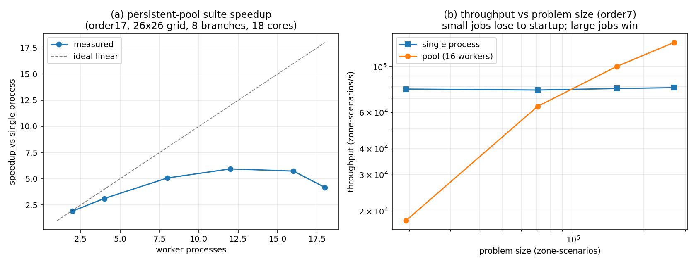
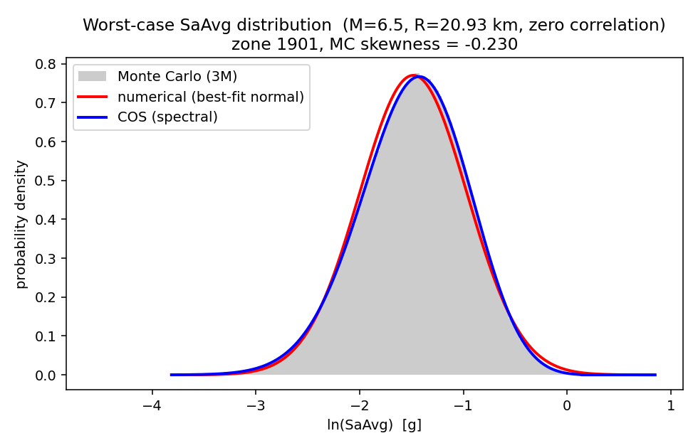
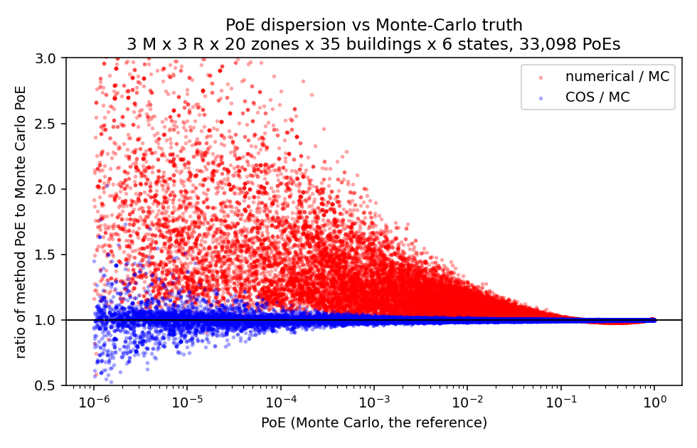
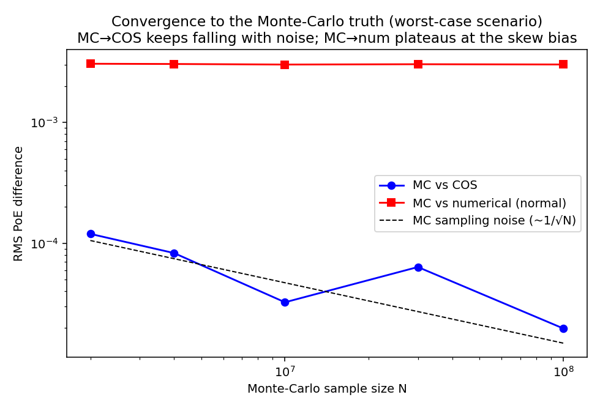
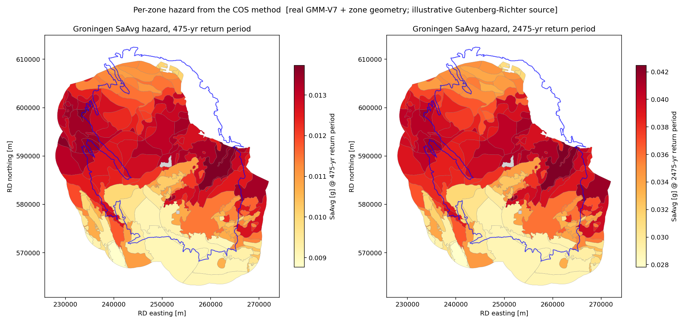

# A deterministic Fourier–cosine (COS) method for the average spectral acceleration distribution in the Groningen seismic hazard and risk chain

*Maxime del Boo, 2026.* This is a readable rendering of the report; the formal,
citable version is [`report.tex`](report.tex). All figures and numbers below are
reproduced by the scripts in this repository.

## Abstract

The Groningen seismic hazard and risk analysis (SHRA) requires, for every source
scenario and site, the full probability distribution of the average spectral
acceleration (SaAvg). The production chain obtains it either by **Monte-Carlo
(MC)** sampling — accurate but slow and storage-heavy — or by a moment-matching
**normal** approximation that is fast but ignores the pronounced **negative
skewness** the non-linear site amplification imprints on SaAvg. We present a
deterministic method that recovers the *full, non-normal* SaAvg distribution at
essentially the cost of the normal method. Conditional on the reference ground
motion, SaAvg is Gaussian; we represent each scenario as a small Gaussian
mixture, compute its leading cumulants (k1, k2, k3) by shared
principal-component Gauss–Hermite quadrature, and invert the cumulant
characteristic function with the **Fourier–cosine (COS)** method. Nothing is
histogrammed to disk — three numbers per scenario — and all downstream integrals
are closed-form or one cached COS evaluation. Against deep MC (10⁸ samples) the
normal method plateaus at a fixed negative-skew bias of tens of percent in the
risk-relevant tail, whereas the COS deviation is sub-percent and falls with the MC
noise (~an order of magnitude more accurate in the deep tail). The full GMM-V7
logic tree (144 branches × 95.2 M zone-scenarios) is computed in **≈2.3 minutes**
on an 18-core workstation. Carried end-to-end, COS reproduces the MC
expected damage, collapse and fatality counts to within **1–3 %**, while the
normal method over-counts the skew-sensitive tail by up to **28 %** —
quantitatively matching the 1.23× over-count reported independently for the
Groningen "Meijdam" metric.

## 1. Introduction

The induced seismicity of the Groningen gas field motivated a uniquely detailed
regional SHRA, coupling a seismic source model, a ground-motion model (GMM-V7), a
site-response amplification model and a fragility/consequence model (FCM-V7) to
produce hazard curves, local personal risk (LPR) maps, and aggregate metrics:
expected damaged/collapsed buildings and the count of buildings exceeding the
Dutch "Meijdam" norm of 10⁻⁵/yr.

The intensity measure that links ground motion to damage is the geometric mean
of spectral acceleration over P = 10 structural periods,

```
ln SaAvg = (1/P) Σ_i ln Sa(T_i),   T_i ∈ {0.01, 0.1, …, 0.85, 1.0} s.
```

Each per-period surface motion is a reference (rock) motion times a non-linear
amplification, both lognormal; the reference motions are strongly correlated
across periods, and the amplification **saturates** at strong shaking. That
saturation truncates the upper tail of ln SaAvg and makes its distribution
**negatively skewed**.

The chain estimates this distribution either by **Monte-Carlo** (exact but slow;
histograms inflate storage to hundreds of GB) or by a **normal moment-matching**
method (fast, but discards the skew). Because the neglected skew is negative, the
normal method systematically **over-estimates** the upper-tail exceedances that
dominate risk.

**Contribution.** We recover the full non-normal SaAvg distribution
deterministically, at the cost of the moment method, via (i) the
conditional-Gaussian-mixture structure of SaAvg, (ii) shared PCA + Gauss–Hermite
quadrature for the cumulants k1, k2, k3, and (iii) COS inversion of the cumulant
characteristic function. We validate against deep MC, benchmark the parallel
performance on the full logic tree, and carry the method to the aggregate risk
metrics and regional hazard maps.

## 2. Method

**Conditional Gaussian mixture.** Let `X ~ N(μ, Σ)` be the reference
log-spectral-acceleration vector for a scenario (M, R); μ, Σ come from GMM-V7.
The surface motion adds a non-linear amplification median ν_i(X_i) and a residual
η_i with std τ_i(X_i). Conditional on X,

```
ln SaAvg | X  ~  N( m(X),  v(X) ),     v(X) = τ(X)ᵀ R_AF τ(X) / P² ,
```

so the characteristic function is the Gaussian expectation
`φ(u) = E_X[ exp(i u m(X) − ½ u² v(X)) ]`.

**Cumulants by shared PCA + Gauss–Hermite.** We eigendecompose Σ, integrate the
leading ρ principal directions with a tensor Gauss–Hermite rule (omitted
directions folded back by a linearised correction plus a Jensen curvature term),
and — because μ, Σ depend only on (M, R) — share the decomposition across all 160
zones. Each scenario becomes a small Gaussian mixture (weights wₙ, means mₙ,
variances vₙ); the cumulants follow in closed form with δₙ = mₙ − k1:

```
k1 = Σ wₙ mₙ,   k2 = Σ wₙ(δₙ² + vₙ),   k3 = Σ wₙ(δₙ³ + 3 δₙ vₙ).
```

Fast setting: rank 2, order 7 (49 nodes). High-accuracy: rank 2, order 17.

**COS inversion.** We approximate φ by the cumulant CF
`φ(u) ≈ exp(i k1 u − ½ k2 u² − i k3 u³/6)` (Gaussian-damped magnitude, cubic
phase carries the skew) and recover the CDF by the Fourier-cosine series of Fang
& Oosterlee on `[k1 ± L√k2]`. N = 64 terms, L = 8 give machine-level accuracy over
q0.01–q0.99. The standardised CDF depends only on the skewness γ1 = k3/k2^1.5, so
it can be pre-tabulated once and every scenario reduced to a table lookup.

**Closed-form fragility/risk.** A limit state is exceeded with probability
`Φ((ln SaAvg − c)/s)`. The demand dispersion is independent Gaussian in
log-space, so the convolution simply **adds s² to k2**; the probability of damage
is one COS evaluation at (k1, k2 + s², k3), or exactly
`E[PoD] = Σ wₙ Φ((mₙ − c)/√(vₙ + s²))`. Hazard and risk are rate-weighted sums of
these, linear in the per-scenario distribution → logic-tree marginalisation is a
weighted sum.

## 3. Implementation and reproducibility

`saavg_cos` is a small, dependency-light package: `spectral_im` (cumulants),
`cos_cache` (COS reconstruction), `fragility`/`source`/`risk_hazard` (chain to
hazard and risk), and `mc` (Monte-Carlo reference, validation only). GMM-V7 and
FCM-V7 parameters are bundled (<2 MB); the seismic source is a transparent
Gutenberg–Richter stand-in (see Scope).

The per-scenario work is embarrassingly parallel and BLAS does not thread the
small contractions, so the full run uses a **persistent process pool** that pays
per-worker start-up once and streams (branch × magnitude-block) tasks, one BLAS
thread per worker.



**Figure 1.** (a) Persistent-pool suite speedup vs worker count — peaks near 6×
at 12 workers (memory bandwidth, not cores, is the ceiling). (b) Throughput vs
problem size: small jobs lose to start-up, large jobs win. The full logic tree —
144 branches × (51×81) cells × 160 zones = **95.2 M zone-scenarios** — is computed
in **≈137 s** (≈6.9×10⁵ zone-scenarios/s) into a 784 MB cumulant lookup; the
parallel assembly reproduces a single-process recompute to float precision.

## 4. Results

### 4.1 Accuracy against Monte-Carlo




**Figure 2.** *Left:* worst-case SaAvg density — MC histogram (left-skewed), the
symmetric normal approximation (red, misplaced peak and tails), and COS (blue,
tracks MC). *Right:* PoE-to-MC ratio over a cloud of scenarios/building
types/damage states: the normal method fans out to 1.5–3× in the tail; COS stays
on unity. Mean |deviation| from MC across the [10⁻¹,1)/[10⁻³,10⁻²)/[10⁻⁶,10⁻³)
PoE bands: normal 0.6 %/18 %/59 % vs COS 0.09 %/0.6 %/3.1 %.



**Figure 3.** Convergence to the MC truth. As N → 10⁸, MC→COS falls like the
sampling noise (∝ N^−½) while MC→normal plateaus at a fixed bias. MC needs many
millions of samples to even distinguish itself from COS, versus a few thousand to
detect the normal method's bias. The COS residual is a small *deterministic*
3-cumulant truncation error (worst convolved-PoE deviation ~4×10⁻³ at the single
most-skewed cell), reducible via the quadrature order or an added k4 — unlike the
normal method's irreducible skew bias.

### 4.2 End-to-end risk metrics

Three methods through **one identical surrogate chain** (real GMM-V7 IM + real
FCM-V7 fragility for the most vulnerable type URM1F_B; Gutenberg–Richter source +
area-weighted exposure of 1.5×10⁵ buildings, source rate calibrated so the
riskiest zone's COS LPR = 10⁻⁴). The methods differ *only* in how P(SaAvg > c) is
computed.

| metric | MC | normal | COS | normal/MC | COS/MC |
|---|---:|---:|---:|---:|---:|
| expected buildings, minor damage (DS1)    | 3878 | 4110 | 3898 | 1.06 | 1.01 |
| expected buildings, moderate damage (DS2) |  642 |  730 |  643 | 1.14 | 1.00 |
| expected buildings, severe damage (DS3)   |  148 |  181 |  146 | 1.22 | 0.99 |
| expected houses collapsed                 |   65 |   83 |   63 | 1.28 | 0.97 |
| expected fatalities per year              |  6.7 |  8.6 |  6.6 | 1.28 | 0.97 |

**Table 1 / Figure 4.** COS reproduces the MC counts to within 1–3 %; the normal
method over-counts progressively more for rarer outcomes (+6 % minor → +28 %
collapse/fatalities). This deep-tail ~1.23× over-count matches the independently
reported 1640/1330 = 1.23 over-count of the normal method on the Groningen
Meijdam metric. Absolute counts depend on the illustrative source/exposure; the
**ratios to MC** are the robust result.


### 4.3 Regional hazard maps



**Figure 5.** Per-zone SaAvg hazard at the 475- and 2475-year return periods over
the Groningen field, COS hazard joined to the geological-zone polygons (GMM-V7
zone ids match the shapefile 160/160). Real GMM-V7 intensity and geometry;
illustrative Gutenberg–Richter source, so the spatial pattern is real site
response while absolute levels await the official forecast.

## 5. Discussion — scope

COS resolves the accuracy/speed/storage trade-off: MC accuracy, moment-method
speed, three numbers per scenario instead of a histogram. Its residual error is a
controllable deterministic quantity (rank/order, COS terms, truncation), not
irreducible sampling noise. The only neglected term at three cumulants is the
small excess kurtosis; adding k4 is straightforward for deeper tails.

**This repo bundles real GMM-V7/FCM-V7 parameters and zone geometry but NOT a
seismicity forecast or exposure database.** The source is a Gutenberg–Richter
stand-in, so absolute hazard/risk levels are illustrative; the *method
comparison* is independent of the source scale and is the scientific claim.
Producing the absolute Groningen numbers needs only the official forecast (TNO
seismic-source-model + Zenodo DOI 10.5281/zenodo.10245813) and an exposure
database — the COS lookup is already in the form those stages consume.

## 6. Conclusion

The full non-normal SaAvg distribution can be computed deterministically and
cheaply by COS inversion of a cumulant characteristic function built from a
conditional Gaussian mixture. The method matches Monte-Carlo to within its
sampling noise, runs the entire GMM-V7 logic tree in minutes, removes the normal
method's tail bias, and carries cleanly to aggregate risk metrics and regional
hazard maps — recovering the MC fatality/collapse counts where the normal method
inflates them by up to 28 %. It is a practical replacement for both Monte-Carlo
and the normal approximation in the intensity-measure stage of the risk chain.
